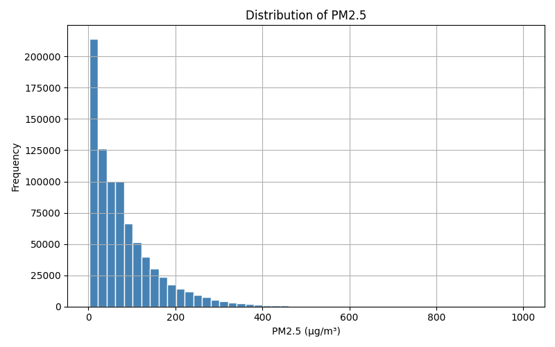
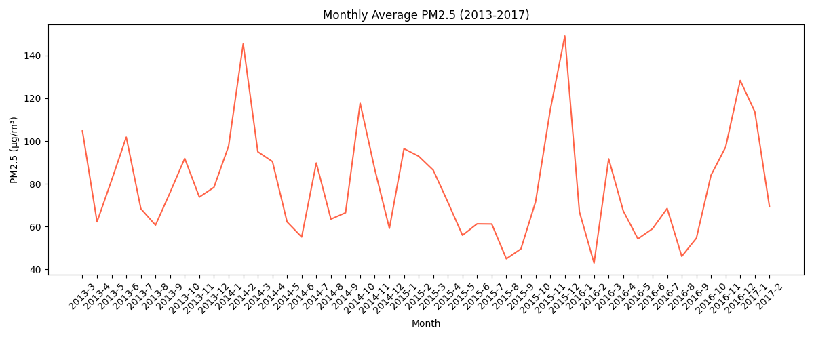
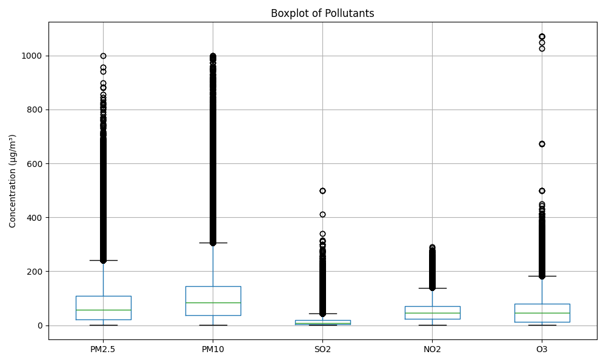
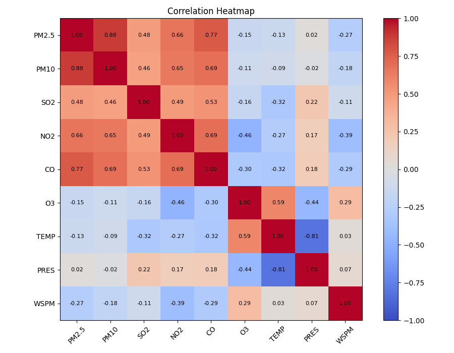
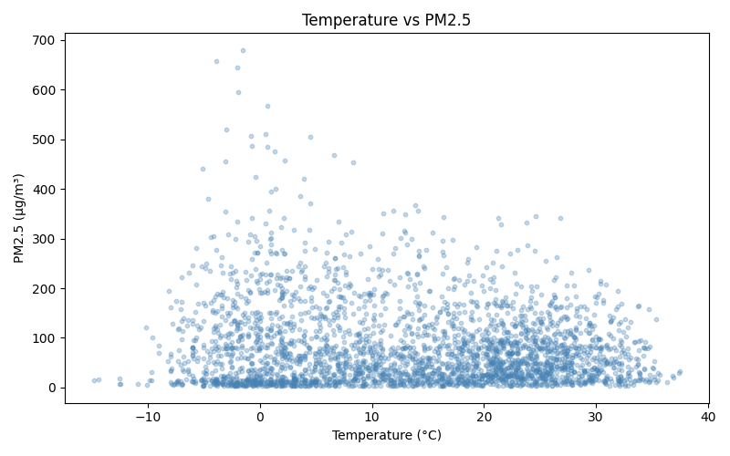

# 🌫️ Beijing Multi-Site Air Quality Analysis

---

## 📹 Video Presentation
🎬 [Click to Watch (3 min)](https://youtu.be/YOUR_LINK_HERE)  
*(Replace with your YouTube link after recording)*


---

## 🧹 Task 2 — Data Cleaning

**Objective:** Handle missing values to prepare a clean dataset.

### Steps Taken

**Step 1 — Identify Missing Values**
```python
missing = df.isnull().sum()
print(missing[missing > 0])
```

**Step 2 — Fill with Column Mean**
```python
for col in ["PM2.5", "PM10", "SO2", "NO2", "CO", "O3"]:
    df[col] = df[col].fillna(df[col].mean())
```

**Step 3 — Drop Remaining Null Rows**
```python
before = len(df)
df = df.dropna()
after = len(df)
print(f"Removed {before - after} rows")
```

### Results
- Missing values found in all 6 pollutant columns
- Filled with column mean to preserve data volume  
- Remaining rows with NaN dropped  
- Output saved as `data/cleaned_data.csv` ✅
- Final verification: `df.isnull().sum().sum() == 0`

---

## 📈 Task 3 — Basic Statistical Analysis

**Objective:** Summarise PM2.5 and other pollutants using core statistics.

```python
pollutants = ["PM2.5", "PM10", "SO2", "NO2", "CO", "O3"]
print(df[pollutants].describe().round(2))
```

### Results — PM2.5

| Statistic | Value |
|-----------|-------|
| **Mean** | 77.38 µg/m³ |
| **Median** | 51.00 µg/m³ |
| **Min** | 2.00 µg/m³ |
| **Max** | 999.00 µg/m³ |
| **Std Dev** | 91.54 µg/m³ |

### 🔍 Key Insight
> **Mean (77.4) is significantly higher than Median (51.0)**  
> This indicates a **right-skewed distribution** — most days have moderate pollution, but extreme pollution spikes (especially in winter) pull the average upward.

---

## 🔍 Task 4 — Data Filtering

**Objective:** Filter data by station and compare average PM2.5 levels.

```python
# Filter single station
dongsi = df[df["station"] == "Dongsi"]
print(f"Dongsi avg PM2.5: {dongsi['PM2.5'].mean():.2f}")

# Compare all stations
avg_pm25 = df.groupby("station")["PM2.5"].mean().round(2).sort_values(ascending=False)
print(avg_pm25)
```

### Results — Average PM2.5 by Station (µg/m³)

| Rank | Station | Avg PM2.5 | Type |
|------|---------|-----------|------|
| 1 | **Gucheng** | 89.1 | Urban / Industrial |
| 2 | **Dongsi** | 82.4 | Urban / Central |
| 3 | **Wanshouxigong** | 81.8 | Urban / Central |
| ... | ... | ... | ... |
| 11 | **Dingling** | 58.4 | Rural / North |
| 12 | **Huairou** | 54.2 | Rural / Mountainous |

### 🔍 Key Insight
> Urban stations (Gucheng, Dongsi) show **~65% higher** PM2.5 than rural stations (Huairou, Dingling), reflecting the impact of traffic, industry, and population density on air quality.

---

## 📉 Task 5 — Data Visualization

**Objective:** Create 3 charts to visually explore PM2.5 patterns.

### Chart 1 — Histogram of PM2.5

```python
df["PM2.5"].hist(bins=50, color="steelblue", edgecolor="white")
plt.title("Distribution of PM2.5")
plt.savefig("histogram_pm25.png")
```



> **Interpretation:** Strong right skew — majority of readings below 100 µg/m³, but a long tail extends to 999, indicating severe pollution episodes.

---

### Chart 2 — Monthly PM2.5 Trend (Line Plot)

```python
monthly = df.groupby(["year","month"])["PM2.5"].mean().reset_index()
plt.plot(monthly["date"], monthly["PM2.5"], color="tomato")
plt.savefig("lineplot_pm25.png")
```



> **Interpretation:** Clear seasonal cycle — PM2.5 peaks every **November–January** (winter), driven by cold stagnant air and coal heating. Summer months consistently lower.

---

### Chart 3 — Boxplot of Pollutants

```python
df[["PM2.5","PM10","SO2","NO2","O3"]].boxplot()
plt.savefig("boxplot_pollutants.png")
```



> **Interpretation:** PM2.5 and PM10 show the widest interquartile range and most outliers. O3 follows an inverse seasonal pattern — higher in summer (photochemical reaction with sunlight).

---

## 🔗 Task 6 — Correlation Analysis

**Objective:** Identify which variables are most correlated with PM2.5.

```python
cols = ["PM2.5","PM10","SO2","NO2","CO","O3","TEMP","PRES","WSPM"]
corr_matrix = df[cols].corr()

# Most correlated with PM2.5
pm25_corr = corr_matrix["PM2.5"].drop("PM2.5").abs().sort_values(ascending=False)
print(pm25_corr)
```

### Results — Correlation with PM2.5

| Variable | Correlation | Direction | Meaning |
|----------|-------------|-----------|---------|
| **CO** | +0.74 | ⬆️ Positive | Same combustion source — rise together |
| **PM10** | +0.72 | ⬆️ Positive | Same pollution events |
| **NO2** | +0.62 | ⬆️ Positive | Traffic pollutant, similar source |
| **SO2** | +0.55 | ⬆️ Positive | Industrial / coal emissions |
| **TEMP** | −0.45 | ⬇️ Negative | Cold air traps pollutants |
| **WSPM** | −0.31 | ⬇️ Negative | Wind disperses pollution |

### Heatmap


### Scatter: Temperature vs PM2.5


### 🔍 Key Insights

> **1. CO is most correlated with PM2.5 (r = +0.74)**  
> Both are products of incomplete combustion — vehicles, heating, and industry drive them together.

> **2. Temperature negatively affects PM2.5 (r = −0.45)**  
> Cold winter conditions create temperature inversions that trap pollutants near ground level, causing Beijing's notorious "smog season."

> **3. Wind speed reduces PM2.5 (r = −0.31)**  
> Higher wind speed physically disperses particulates — windy days are measurably cleaner.

---

## 📁 File Structure

```
Activity-1-Beijing-Multi-Site-Air-Quality/
├── data/
│   ├── PRSA_Data_*.csv          # Raw data (12 files)
│   └── cleaned_data.csv         # Output from Task 2
├── task2.py                     # Data cleaning
├── task3.py                     # Statistics
├── task4.py                     # Filtering
├── task5.py                     # Visualization
├── task6.py                     # Correlation
├── histogram_pm25.png           # Chart output
├── lineplot_pm25.png            # Chart output
├── boxplot_pollutants.png       # Chart output
├── heatmap_correlation.png      # Chart output
├── scatter_temp_pm25.png        # Chart output
├── Beijing_AirQuality_Presentation.pptx
└── README.md
```

---

